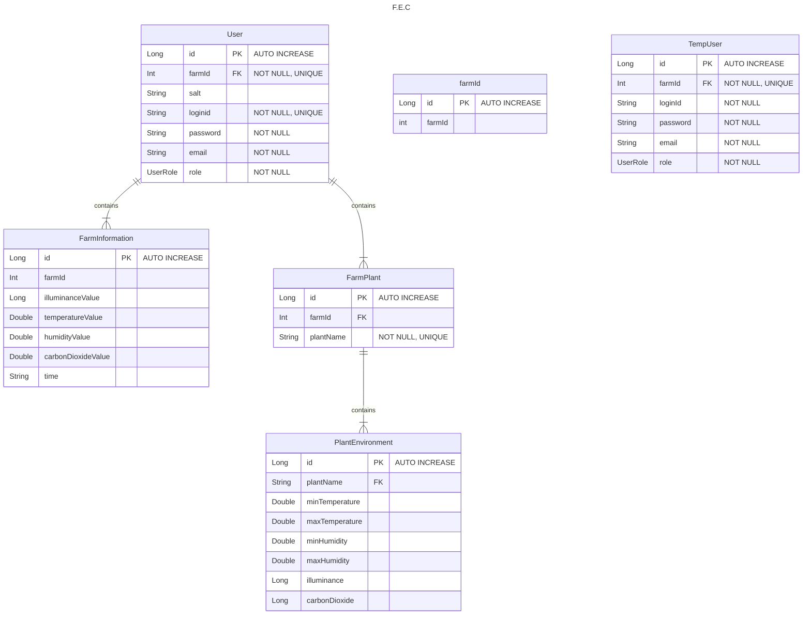

```mermaid
---
title: F.E.C
---

erDiagram
    User ||--|{ FarmInformation : contains
    User ||--|{ FarmPlant : contains
    User{
        Long id PK "AUTO INCREASE"
        Int farmId FK "NOT NULL, UNIQUE"
        String salt
        String loginid "NOT NULL, UNIQUE" 
        String password "NOT NULL"
        String email "NOT NULL"
        UserRole role "NOT NULL"
    }

    farmId{
        Long id PK "AUTO INCREASE"
        int farmId
    }

    TempUser{
        Long id PK "AUTO INCREASE"
        Int farmId FK "NOT NULL, UNIQUE"
        String loginId "NOT NULL"
        String password "NOT NULL"
        String email "NOT NULL"
        UserRole role "NOT NULL"
    }
    FarmInformation{
        Long id PK "AUTO INCREASE"
        Int farmId
        Long illuminanceValue 
        Double temperatureValue
        Double humidityValue
        Double carbonDioxideValue
        String time
    }
    FarmPlant ||--|{ PlantEnvironment : contains
    FarmPlant{
        Long id PK "AUTO INCREASE"
        Int farmId FK
        String plantName "NOT NULL, UNIQUE"
    }
    PlantEnvironment{
        Long id PK "AUTO INCREASE"
        String plantName FK
        Double minTemperature
        Double maxTemperature
        Double minHumidity
        Double maxHumidity
        Long illuminance
        Long carbonDioxide
    }
```
