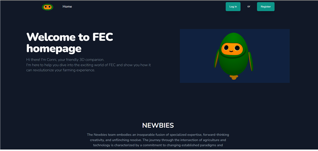
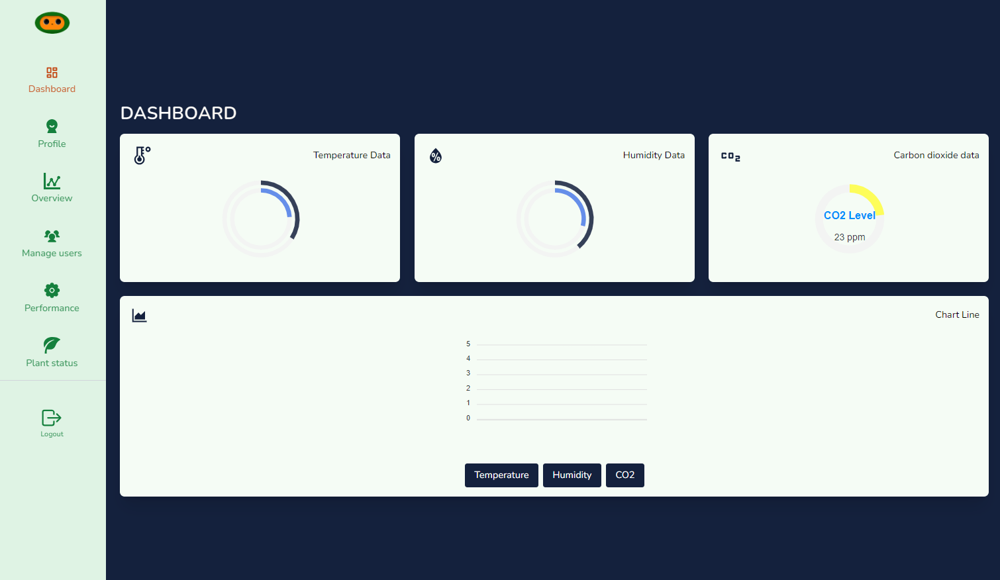

## 🌱**2023_BootCamp_FEC**
스마트 팜 제어 웹페이지 제작 프로젝트

#### ▶️ 본 연구는 과학기술정보통신부 및 정보통신기획평가원의 SW전문인재양성사업의 연구결과로 수행되었음
   
##  ✅ 프로젝트 진행 기간   
2023.07.24(월)~2023.08.23(수)

## ✅ 프로젝트 목적
Arduino ESP32(ET-Board)를 활용하여 식물의 성장을 모니터링하는데 필요한 여러 정보를 디스플레이하고 스마트팜 제어에 필요한 다양한 기능을 제공한다.

## ✅ 제품 기능
- 로그인 기능 
- Dashboard 기능 
- OverView 기능 
- Manage users 기능 
- Performance 기능  
- Plant status 기능 

## ✅Tech Stack
 Back_End
- Spring Boot 3.0
- MySql

Front_End
- React-Vite
- Tailwind CSS
- Full-calendar
- Splinetool
- Bizchart
- Hyper-UI
- Sass

Device
- Arduino ESP32 (ET Board)
- C++

AI
- Flask
- roboflow

## 👪 팀원
- 한승헌 (팀장, BakcEnd, Sensor)
- 오강체첵 (FrontEnd)
- 임지수 (AI)

