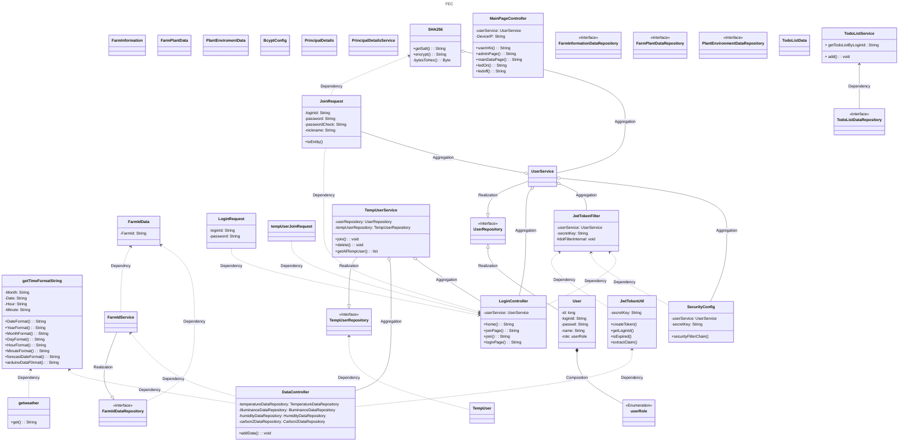

```mermaid
---
title: FEC
---
classDiagram
class getTimeFormatString {
-Month: String
-Date: String
-Hour: String
-Minute: String
+DateFormat(): String
+YearFormat(): String
+MonthFormat(): String
+DayFormat(): String
+HourFormat(): String
+MinuteFormat(): String
+forecastDateFormat(): String
+arduinoDataF0rmat(): String
}
class getweather{
+get(): String
}

    class FarmIdData{
        -FarmId: String
    }

    class FarmInformation{

    }
    class FarmPlantData{

    }
    class PlantEnviromentData{

    }

    class JoinRequest{
        -loginId: String
        -password: String
        -passwordCheck: String
        -nickname: String
        +toEntity()
    }
    class LoginRequest{
        -loginId: String
        -password: String
    }
    class tempUserJoinRequest{

    }
    class TempUser{

    }
    class User{
        -id: long
        -loginId: String
        -passwd: String
        -name: String
        -role: userRole
    }

    class userRole{
        <<Enumeration>>
    }


    class JwtTokenFilter{
        -userService: UserService
        -secretKey: String
        #dolFilterInternal: void
    }

    class JwtTokenUtil{
        -secretKey: String
        +createToken()
        +getLoginId()
        +isExpired()
        +extractClaim()
    }

    class BcyptConfig{

    }
    class PrincipalDetails{

    }
    class PrincipalDetailsService{

    }

    class SecurityConfig{
        -userService: UserService
        -secretKey: String
        +securityFilterChain()
    }

    class SHA256{
        +getSalt(): String
        +encrypt(): String
        -bytesToHex(): Byte
    }
    class TempUserService{
        -userRepository: UserRepository
        -tempUserRepository: TempUserRepository
        +join(): void
        +delete(): void
        +getAllTempUser(): list<TempUser>
    }

    class DataController{
        -temperatureDataRepository: TemperatureDataRepository
        -illuminanceDataRepository: IlluminanceDataRepository
        -humidityDataRepository: HumidityDataRepository
        -carbon2DataRepository: Carbon2DataRepository
        +addData(): void
    }
    class LoginController{
        -userService: UserService
        +home(): String
        +joinPage(): String
        +join(): String
        +loginPage(): String
    }
    class MainPageController{
        -userService: UserService
        -DeviceIP: String
        +userInfo(): String
        +adminPage(): String
        +mainDataPage(): String
        +ledOn(): String
        +ledoff(): String
    }
    class FarmIdDataRepository{
        <<Interface>>
    }
    class FarmInformationDataRepository{
        <<Interface>>
    }
    class FarmPlantDataRepository{
        <<Interface>>
    }
    class PlantEnvironmentDataRepository{
        <<Interface>>
    }
    class TempUserRepository{
        <<Interface>>
    }
    class UserRepository{
        <<Interface>>
    }
    class TodoListData{

    }
    class TodoListDataRepository{
        <<Interface>>
    }
    class TodoListService{
        + add(): void
        + getTodoListByLoginId : String
    }

    TodoListService <-- TodoListDataRepository : Dependency
    User *-- userRole : Composition
    getTimeFormatString <.. getweather: Dependency
    getTimeFormatString <.. DataController: Dependency
    JoinRequest ..> LoginController: Dependency
    JoinRequest --o UserService: Aggregation
    tempUserJoinRequest ..> LoginController: Dependency
    LoginRequest ..> LoginController: Dependency
    TempUserRepository <..TempUser: Dependency
    UserRepository <|-- User: Realization

    JwtTokenFilter <.. JwtTokenUtil: Dependency
    JwtTokenFilter <.. SecurityConfig: Dependency

    JwtTokenUtil <.. DataController: Dependency
    JwtTokenFilter <.. LoginController: Dependency
    SHA256 <.. JoinRequest: Dependency
    SHA256 o-- UserService: Aggregation
    TempUserService --|> TempUserRepository: Realization
    TempUserService o-- DataController: Aggregation
    TempUserService o-- LoginController: Aggregation
    UserService --|> UserRepository: Realization
    UserService o-- LoginController: Aggregation
    UserService o-- JwtTokenFilter: Aggregation
    UserService o-- SecurityConfig: Aggregation
    FarmIdData <.. FarmIdService: Dependncy
    FarmIdData <.. FarmIdDataRepository: Dependency
    FarmIdService --|> FarmIdDataRepository: Realization
    FarmIdService <.. DataController: Dependency
```

